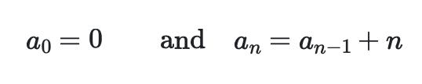

# Calculating the triangular numbers

In the programming exercises that we have completed thus far we have used python to calculate series where the nth element of the series is some function of n.  For example, the nth element of the seven times table (a series) is just 7 multiplied by n.  This is not the only way of explaining how the elements in a series are calculated.  The elements in the series of triangular numbers can, for instance be defined as follows:



In other words, the zeroth element in this series is zero. All elements with n>0 can then be calculated by adding n to to the previous element in the series.  The first few terms in this series are thus:


__To complete this exercise I would like you to complete the code in `main.py` so that it does the following__:

1. Create an array called `triangularNumbers`.  This array should have 100 elements.
2. Set `triangularNumbers[0]` equal to 0.
3. Write a for loop that uses the formulas given above to evaluate the remaining 99 elements in the array `triangularNumbers`.
4. Use the plot command to draw a graph that shows the triangular numbers you have calculated on the y-axis.  The first point you plot should have x=1, the second x=2, the third x=3 and so on. 
5. Use the axis labels that I have provided in the plotting commands in `main.py`

***

Note: If you write:

```python
for i in range(1,4) : 
    print(i) 
```

This code will output:

```python
1
2
3
```

as the loop runs for all the integers, i, that have 0<i<4. 
